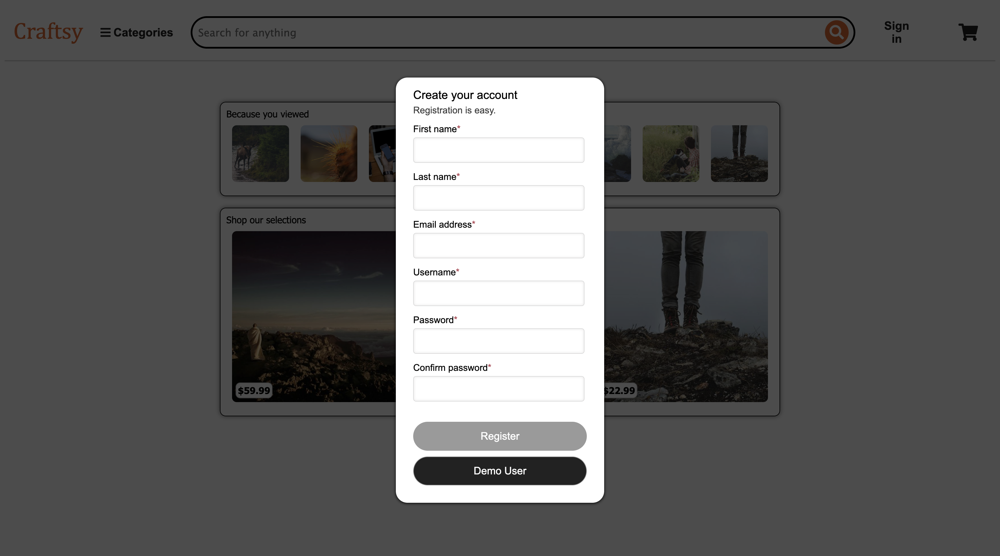
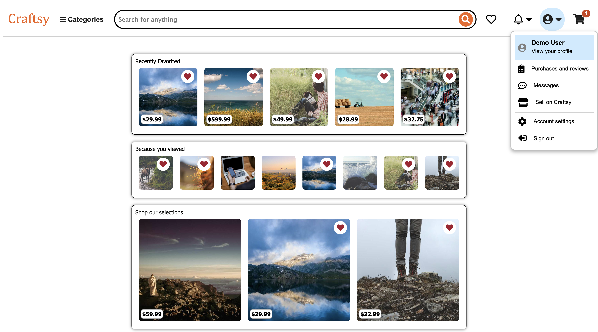
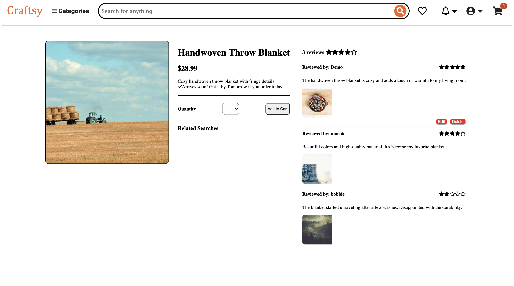
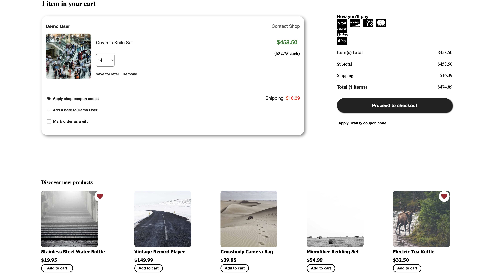

# Welcome to Craftsy!!!

## About The Project
_Craftsy_ is an [_Etsy_](https://www.etsy.com/) clone, an app designed to connect consumers with sellers of handcrafted and vintage goods. 

## The Team
* [Tamara Mousa](https://github.com/T3mousa)
* [Ian Kim](https://github.com/iankimm)
* [Krystal Kimmel](https://github.com/kryskimmel)
* [Daniel Calderon](https://github.com/Calderon1199)
* [Will Torres](https://github.com/wtorresjr)

## Screenshots
### Sign up

### Homepage

### Search

### Product detail

### Favorites

### Cart

## Features
### New account creation Log in, log out, and guest/demo login:
- Users can sign up, log in, and log out.
- Users can use a demo log in to try the site.
- Users can't use certain features without logging in (like Creating Products, leaving reviews, etc.)
- Users who log in while browsing a product will be redirected to the home page.
- Logged out users are redirected to home page.

## Products
### All Users:
- Should be able to view all Products.

### Authenticated & Authorized Users:
- Should be able to create a Product.
- Should be able to update their Product(s).
- Should be able to delete their Product(s).

## Reviews
### All Users:
- Should be able to view all reviews on a Product.

### Authenticated & Authorized Users:
- Should be able to create a review for a Product.
- Should be able to update their review for a Product.
- Should be able to delete their review from a Product.

## Shopping Cart
### All Users:
- Should be able to view all products added to their cart.
- Should be able to add products to their shopping cart.
- Should be able to remove products from their shopping cart.

### Authenticated Users:
- Should be able to preform a "transaction" to complete their purchase.

## Favorites
### Authenticated & Authorized Users:
- Should be able to view all of their favorite products.
- Should be able to favorite products.
- Should be able to delete products from their favorites.

## Technologies Used

#### Acknowledgments
- Inspired by Etsy
- Icons by Font Awesome
